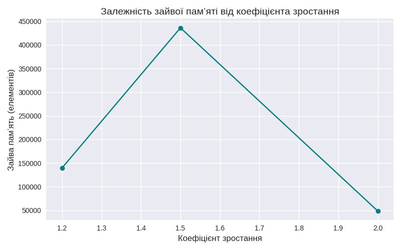

# dynamic_array

**Динамічний масив** — це структура даних, яка зберігає елементи в суцільному блоці памʼяті та автоматично збільшує свою місткість (*capacity*), коли місце закінчується.

**Збільшення capacity** відбувається не по 1 елементу, а стрибками — щоб операція `append` у середньому була швидкою.

**growth_factor** — коефіцієнт, на який множиться поточна capacity під час розширення.  
Наприклад, `1.5` означає +50% до розміру.

**Resize** відбувається тоді, коли кількість елементів дорівнює поточній capacity — створюється новий масив більшого розміру і всі елементи копіюються.

---

## Пояснення роботи коду

- `__init__`  
  Ініціалізує масив, початкову capacity, лічильник елементів та параметри росту.

- `append`  
  Додає елемент у кінець масиву. Якщо місця нема — викликає `_resize`.

- `_resize`  
  Створює новий масив більшого розміру, копіює всі елементи та збільшує `resize_count`.

**Final capacity** — фактичний розмір внутрішнього масиву після всіх вставок.  
**resize_count** — скільки разів відбувалось перевиділення памʼяті.

---

## Перевірка

Вставлено **1 000 000** елементів для різних `growth_factor`.

### Результати

| growth_factor | final capacity | resize count | wasted memory |
|---------------|--------------- |--------------|---------------|
| 1.2           | 1139738        | 50           | 139738        |
| 1.5           | 1436239        | 23           | 436239        |
| 2.0           | 1048576        | 13           | 48576         |

---

## Графік

Залежність зайвої памʼяті від `growth_factor`:

## Висновок

- `growth_factor = 1.2` — мінімум зайвої памʼяті, але багато resize — повільніше.
- `growth_factor = 2.0` — мінімум resize, але багато зайвої памʼяті.
- `growth_factor = 1.5` — найкращий баланс між кількістю перевиділень і витратами памʼяті.